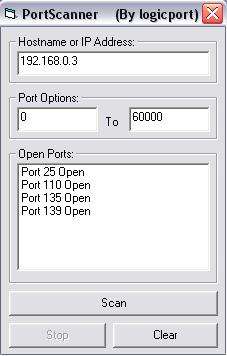



## Simple \(Port Scanner\)

### Description

Scans for open ports on a computer. Very fast and simple.
 
### More Info
 

             |
---                |---
**Submitted On**   |2003-10-29 12:36:02
**By**             |[logicport](https://github.com/Planet-Source-Code/PSCIndex/blob/master/ByAuthor/logicport.md)
**Level**          |Beginner
**User Rating**    |5.0 (10 globes from 2 users)
**Compatibility**  |VB 6\.0
**Category**       |[Internet/ HTML](https://github.com/Planet-Source-Code/PSCIndex/blob/master/ByCategory/internet-html__1-34.md)
**World**          |[Visual Basic](https://github.com/Planet-Source-Code/PSCIndex/blob/master/ByWorld/visual-basic.md)
**Archive File**   |[Simple\_\(Po16645410292003\.zip](https://github.com/Planet-Source-Code/logicport-simple-port-scanner__1-49512/archive/master.zip)

